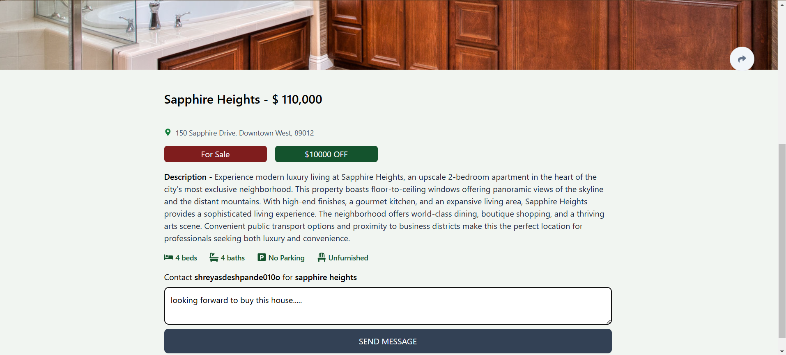

# Real Estate App

## Overview
The Real Estate App is a user-friendly platform that allows buyers, sellers, and renters to browse, list, and manage real estate properties. It aims to streamline the property search process and provide an intuitive experience for users, helping them to find or list homes efficiently. The project is built with React, ensuring a fast, responsive, and scalable solution.

---

## Tech Stack

- **Frontend**:  
  - React
  - React Router
  - Axios (for API requests)
  - Redux (for state management)
  - Material-UI (for UI components)
  - TailwindCSS (for styling)
  
- **Backend** (if applicable):
  - Node.js
  - Express
  - Firebase
  - MongoDB (for data storage)

---

## Features

- **Property Listings**:  
  Users can view available properties with details such as price, location, amenities, and photos.

- **Search & Filters**:  
  A powerful search feature with filters for property type, price range, location, etc.

- **User Authentication**:  
  Secure login/signup functionality for both buyers and sellers using JWT authentication.

- **Add Property**:  
  Sellers can easily add new properties by uploading details and images.

- **Responsive Design**:  
  Fully responsive design, optimized for both desktop and mobile devices.

- **Contact Form**:  
  Potential buyers can directly contact sellers through an integrated contact form.

---

## Screenshots




---

## How to Run Locally

1. **Clone the repository**:
   ```bash
   git clone https://github.com/shreyJS/real-estate-app.git
   ```
   
2. **Install dependencies and run the server(root directory)**:
   ```bash
   npm install
   npm run start
   ```

3. **Navigate to frontend, install dependencies and run the frontend(root/client directory)**:
   ```bash
   cd client
   npm install
   npm run dev
   ```

4. **Visit the running port on browser**:

---

## Features coming soon...

- **Property Recommendations:**
  Implement an AI-based recommendation system to suggest properties based on user preferences and search history.

- **Real-Time Updates:**  
  Integrate a real-time notification system to alert users about new listings or price drops.

- **Admin Dashboard:**
  Build a dashboard for admins to manage listings, approve property submissions, and monitor user activity.

- **Geo-Location Services:**  
  Integrate Google Maps API to display property locations and provide distance-based filters.
